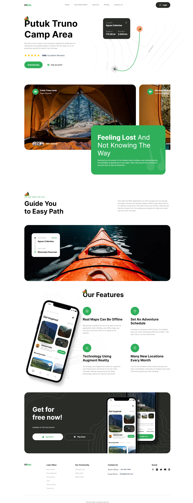

<a name="readme-top"></a>

<div align="center">


<br />
<br />

[](https://github.com/ladunjexa)
[](https://github.com/ladunjexa/nextjs13-devoverflow/blob/main/LICENSE)
[](https://github.com/ladunjexa/nextjs13-devoverflow/graphs/contributors)

[](https://github.com/ladunjexa/nextjs13-devoverflow/network/members)
[](https://github.com/ladunjexa/nextjs13-hilink/stargazers)
[](https://github.com/ladunjexa/nextjs13-hilink/issues/)
[](https://github.com/ladunjexa/nextjs13-hilink/issues/)


</div>

Dive into the world of Next.js, Incredible Frontend Hilink website built with Next.js using TypeScript & Tailwind CSS 🪐

#### [View Demo](https://nextjs13-hilink.vercel.app/)

## Table of Contents

- [Table of Contents](#table-of-contents)
- [:star2: Introduction](#star2-introduction)
  - [Folder Structure](#folder-structure)
    - [.vscode](#vscode)
    - [app](#app)
    - [components](#components)
    - [constants](#constants)
    - [assets](#assets)
    - [types](#types)
- [:space_invader: Technologies Used](#space_invader-technologies-used)
- [:toolbox: Getting Started](#toolbox-getting-started)
  - [:gear: Installation and Run Locally](#gear-installation-and-run-locally)
    - [Step 1](#step-1)
    - [Step 2](#step-2)
    - [Step 3](#step-3)
    - [Step 4](#step-4)
  - [Learn More](#learn-more)
  - [Deploy on Vercel](#deploy-on-vercel)
- [:camera: Screenshots](#camera-screenshots)
- [:wave: Contributing](#wave-contributing)
- [:warning: License](#warning-license)
- [:handshake: Contact](#handshake-contact)

## :star2: Introduction

Hilink website is a web application built with Next.js using TypeScript & Tailwind CSS. The application is a landing page used to showcase the mobile application. The website is responsive and works great on mobile devices and tablets. The web application is designed using Tailwind CSS, linted with ESLint and formatted with Prettier. The application is deployed on Vercel.

### Folder Structure

<b>Hilink</b> code folder structure is as follows:

```
nextjs13-hilink/
├── .vscode/
├   └── settings.json
├── app/
├   ├── favicon.ico
├   ├── globals.css
├   ├── layout.tsx
├   └── page.tsx
├── components/
├   ├── layout/
├   ├   ├── Footer.tsx
├   ├   └── Navbar.tsx
├   ├── shared/
├   ├   └── Button.tsx
├   └── sections/
├       ├── Hero.tsx
├       ├── Camp.tsx
├       ├── Guide.tsx
├       ├── Features.tsx
├       └── GetApp.tsx
├── constants/
├   └── index.ts
├── public/
├   └── assets/
├   ├   ├── icons/
├   ├   ├   └── [[...]].svg
├   ├   └── images/
├   ├       └── [[...]].{png,svg}
├   ├── next.svg
├   └── vercel.svg
├── types/
├   └── index.d.ts
├── .eslintrc.json
├── next.config.js
├── package.json
├── postcss.config.js
├── tailwind.config.js
└── tsconfig.json
```

Now let's dive into the root folder and see what it contains.

#### .vscode

`settings.json`

This is a JSON file contains the settings used in Visual Studio Code.

#### app

`favicon.ico` - `globals.css` - `layout.tsx` - `page.tsx`

The app directory contains the application's favicon, the global styles, the layout component and the page component which is the home page of the application.

#### components

`layout/`: `Footer.tsx` - `Navbar.tsx`

The layout directory contains the layout components of the application. The layout components are the Navbar and the Footer.

`shared/`: `Button.tsx`

The shared directory contains the shared components of the application. The shared components are the Button component.

`sections/`: `Hero.tsx` - `Camp.tsx` - `Guide.tsx` - `Features.tsx` - `GetApp.tsx`

The sections directory contains all the sections used in the application. Each section is a React component. The sections are imported in `app/page.tsx` and rendered in the application.

#### constants

`index.ts`

This is a TypeScript code contains all the constants used in the application, specifically the Navbar and Footer links (`navLinks`, `footerLinks`, `footerContactInfo`, `socials`), the `features` used in the Features section and the `peopleUrl` used in the Camp section.

#### assets

`icons/` - `images/` `react.svg`

The public directory contains the media used in the application. The assets folder contains all the images and icons used in the application.

#### types

`index.d.ts`

This is a TypeScript code contains all the types used in the application, more precisely the interfaces.

<p align="right">(<a href="#readme-top">back to top</a>)</p>

## :space_invader: Technologies Used

Hilink web application is built using the following technologies:

- [TypeScript](https://www.typescriptlang.org/): TypeScript is a typed superset of JavaScript that compiles to plain JavaScript.
- [Next.js](https://nextjs.org/): Next.js is an open-source React front-end development web framework created by Vercel that enables functionality such as server-side rendering and generating static websites for React based web applications.
- [Tailwind CSS](https://tailwindcss.com/): Tailwind CSS is a utility-first CSS framework for rapidly building custom user interfaces.
- [ESLint](https://eslint.org/): ESLint is a static code analysis tool for identifying problematic patterns found in JavaScript code.
- [Vercel](https://vercel.com/): Vercel is a cloud platform for frontend developers, providing the frameworks, workflows, and infrastructure to build a faster, more personalized Web.

[](https://skillicons.dev)

<p align="right">(<a href="#readme-top">back to top</a>)</p>

## :toolbox: Getting Started

<!-- Installation -->

### :gear: Installation and Run Locally

#### Step 1

Download or clone this repo by using the link below:

```bash
 https://github.com/ladunjexa/nextjs13-hilink.git
```

#### Step 2

**Hilink** using NPM (Node Package Manager), therefore, make sure that Node.js is installed by execute the following command in consle

```bash
  node -v
```

#### Step 3

Go to root folder and execute the following command in console to get nodemon the required packages:

```bash
npm install
```

#### Step 4

Go to root folder and execute the following command in console to start the application locally:

```bash
npm run dev
```

This is a [Next.js](https://nextjs.org/) project bootstrapped with [`create-next-app`](https://github.com/vercel/next.js/tree/canary/packages/create-next-app).

### Learn More

To learn more about Next.js, take a look at the following resources:

- [Next.js Documentation](https://nextjs.org/docs) - learn about Next.js features and API.
- [Learn Next.js](https://nextjs.org/learn) - an interactive Next.js tutorial.

You can check out [the Next.js GitHub repository](https://github.com/vercel/next.js/) - your feedback and contributions are welcome!

### Deploy on Vercel

The easiest way to deploy your Next.js app is to use the [Vercel Platform](https://vercel.com/new?utm_medium=default-template&filter=next.js&utm_source=create-next-app&utm_campaign=create-next-app-readme) from the creators of Next.js.

Check out our [Next.js deployment documentation](https://nextjs.org/docs/deployment) for more details.

<p align="right">(<a href="#readme-top">back to top</a>)</p>

## :camera: Screenshots



<p align="right">(<a href="#readme-top">back to top</a>)</p>

## :wave: Contributing

<a href="https://github.com/ladunjexa/Rainblur-Portfolio-Showcase/graphs/contributors">
  
</a>

Contributions are always welcome!

See [`contributing.md`](https://contributing.md/) for ways to get started.

Contributions are what make the open source community such an amazing place to learn, inspire, and create. Any contributions you make are **greatly appreciated**.

If you have a suggestion that would make this better, please fork the repo and create a pull request. You can also simply open an issue with the tag "enhancement".
Don't forget to give the project a star! Thanks again!

1. Fork the Project
2. Create your Feature Branch (`git checkout -b feature/AmazingFeature`)
3. Commit your Changes (`git commit -m 'Add some AmazingFeature'`)
4. Push to the Branch (`git push origin feature/AmazingFeature`)
5. Open a Pull Request

<p align="right">(<a href="#readme-top">back to top</a>)</p>

## :warning: License

_Hilink_ web application is open source and distributed under the [MIT License](https://github.com/ladunjexa/nextjs13-hilink/blob/main/LICENSE).

<p align="right">(<a href="#readme-top">back to top</a>)</p>

## :handshake: Contact

If you want to contact me, you can reach me at [@ladunjexa](https://t.me/ladunjexa).

<p align="right">(<a href="#readme-top">back to top</a>)</p>
